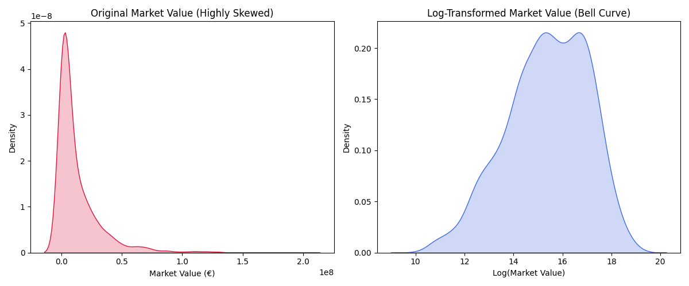
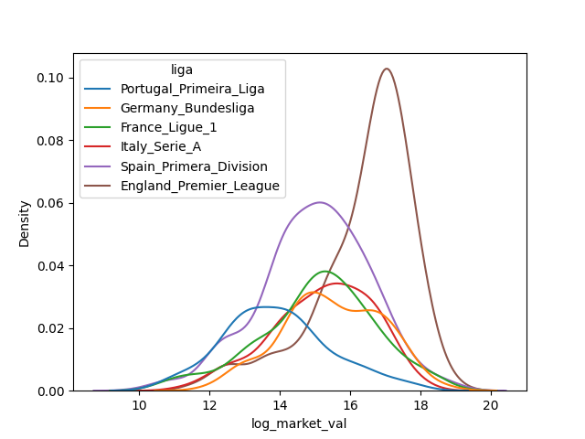
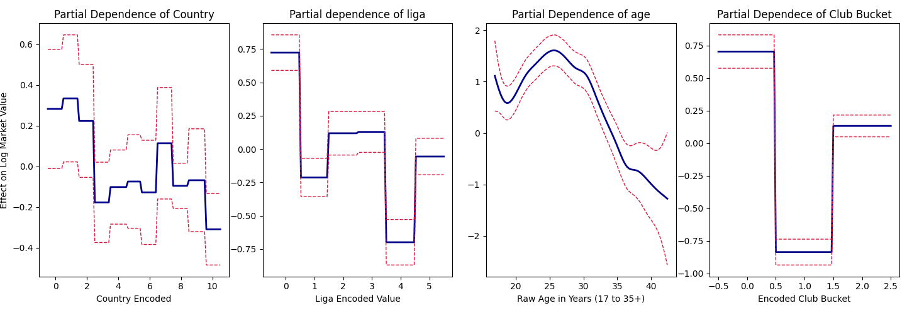

# TFM Scouting - FC Barcelona
Rodrigo Martinez

# Resumen del Proyecto

Este repositorio contiene el Trabajo de Fin de Master (TFM) Scouting del
FC Barcelona, en análisis de big data deportivo, cuyo objetivo principal
es el desarrollo de un dashboard interactivo en un (local host)
orientado al análisis y la simulación de la ventana de fichajes para el
FC Barcelona a partir de evidencia estadística de la temporada 2025/26
de las cinco grandes ligas de Europa (España, Inglaterra, Italia,
Portugal y Francia).

La herramienta integra datos procedentes de múltiples fuentes, públicas
y bases de datos que fueron proveídos por la universidad para el
desarrollo del proyecto. Entre las fuentes públicas utilicé Kaggle,
FBref, Transfermarkt, Understat y Sofascore. Las fuentes de daatos
fueron combinadas y analizadas, para posteriormente ser limpiadas para
su correcta interpretación para el análisis posterior. Uno de los
diferenciadores principales del trabajo es haber realizado un modelo de
machine learning no supervisadoss que identifica perfiles de jugadores
estilísticamente comparables a los de las plantilla actual del club,
basados puramente en sus estadísticas durante la temporada. De De este
modo, el sistema no se limita a describir el rendimiento, sino que
propone candidatos de sustitución o refuerzo fundamentados en la
similitud de su huella estadística.

El proyecto se estructura principalmente en tres capas: (1) captura y
procesamiento de datos (ETL), para la limpieza y armonización de las
fuentes, (2) modelización, que comprende un componente no supervisado de
segmentación de jugadores y un componente supervisado de valor de
mercado y (3) presentación, que es el dashboard web como un “local
host”.

## Naturaleza del trabajo

El propósito analítico es exploratorio y para apoyo a toma de decisiones
basadas en datos y estadísticas. El modelo no pretende sustituir el
criterio técnico del cuerpo deportivo, sino aportar un criterio objetivo
y reproducible que reduzca el tiempo de búsqueda de candidatos y pueda
dar los perfiles más adecuados para el juego.

# Estructura y canalización de los datos

La estructura de la información cuenta con varios scripts. Cada uno de
los scripts produce archivos en formatos (`.json` y/o `.parquet`) que
garantizan que el dashboard pueda servirse sin dependencia de conexión
en tiempo de ejecución.

En listado del scipt y su función son los siguientes: Script \| Función
`01_process_data.py` \| Limpieza y filtrado de los CSV de Kaggle
(partidos, jugadores, transferencias, valoraciones).
`02_fetch_understat.py` \| Descarga de métricas de expectativa (xG, xGA,
NPxG, xPTS) desde Understat. `03_fetch_epl_detail.py` \| Cacheado de la
API pública de la Premier League (plantillas, estadísticas, partidos).
`04_fetch_epl_understat_squads.py` \| Fusión de jugadores Understat con
metadatos de la PL API. `05_generate_league_team_details.py` \|
Generación de detalle por equipo para LaLiga, Bundesliga, Serie A y
Ligue 1. `06_fetch_sofascore_squads.py` \| Enriquecimiento con dorsales
y posiciones oficiales (Sofascore). `model_unsupervised.py` \|
Segmentación de jugadores por posición y búsqueda de perfiles
comparables. `supervised_model.py` \| Preparación del conjunto de
entrenamiento para la estimación de valor.

## Fuentes de datos

1.  Kaggle / FBref: ndicadores clave de rendimiento (KPI) y estadísticas
    base por jugador (temporada 2025/26).
2.  Transfermarkt (Kaggle): Resultados de partidos, historial de
    transferencias y valoraciones de mercado.
3.  Understat: Métricas de expectativa a nivel de equipo y de partido
    (xG, xGA, NPxG, xPTS), que permiten contextualizar el rendimiento
    más allá del resultado.
4.  Premier League API (PulseLive) y Sofascore: Ddatos de plantilla
    (dorsal, posición oficial, nacionalidad).

# Procesamiento de datos

Este script constituye la base del proyecto. Lo que hace principalmente
es transformar los CSV de Kaggle en formato `.json` utilizables por el
dashboard, aplicando filtros relativos al FC Barcelona y a las
competiciones relevantes.

Las operaciones principales son: 1. Procesamiento de partidos
(`games.csv`): Se filtran los partidos de la temporada 2025/26 y se
calcula el resultado relativo al Barça (victoria, empate o derrota) en
función de su condición de local o visitante. Los partidos se segmentan
posteriormente por competición (LaLiga, Champions League, Copa del Rey,
Supercopa). 2. Procesamiento de jugadores
(`players_data-2025_2026.csv`): Se extraen tanto un conjunto de columnas
base como uno de estadísticas avanzadas, y se conservan versiones para
el conjunto global (comparativa entre ligas) y para la plantilla del
Barça. 3.Transferencias y valoraciones: Se identifican los movimientos
de entrada y salida del club y se construye la serie temporal del valor
de mercado agregado de la plantilla. 4. Premier League (Understat): Se
procesan las tablas clasificatorias (total, local y visitante) con
métricas de expectativa, los datos por jugador y una reconstrucción de
la progresión de puntos por jornada.

## Coexistencia de Pandas y Polars

El sctipt emplea simultáneamente ‘pandas’ y ‘polars’. ‘pandas’ se
utiliza para las transformaciones de compatibilidad directa a JSON,
mientras que `polars` aporta una sintaxis declarativa y eficiente para
el cálculo de expresiones condicionales (por ejemplo, el resultado
relativo al Barça mediante `pl.when().then().otherwise()`). Se
recomienda homogeneizar la gestión de rutas (uso consistente de
`os.path.join` frente a separadores literales `\\`) para garantizar la
portabilidad entre sistemas operativos.

## Métricas de expectatica (`02_fetch_understat.py`)

Recupera de Understat las métricas de expectativa por liga y equipo (xG,
xGA, NPxG, xPTS). El script implementa una extracción de las variables
JavaScript integradas en el HTML, priorizando la última temporada
completa disponible (2025/26). Adicionalmente, descarga el detalle de
partidos, jugadores y estadísticas del FC Barcelona.

## Detalle de la Premier League (`03_fetch_epl_detail.py`) !!!!

Inspecciona desde la API pública de la Premier League los veinte equipos
de la temporada 2025/26. Recupera la plantilla completa, las
estadísticas de equipo (con etiquetas traducidas al español) y los
partidos disputados. Una decisión de diseño relevante es no filtrar por
`currentTeam.id`, de modo que se incluya la totalidad de jugadores
inscritos.

## Armonización de identidades de jugador (`04`, `05` y `06`)

Estos tres scripts abordan un problema recurrente y crítico en la
integración de fuentes deportivas: la resolución de identidades, es
decir, la correspondencia de un mismo jugador entre fuentes que escriben
su nombre de forma distinta (con o sin tildes, con caracteres
especiales, con nombre completo o apellido).

# Modelo no supervisado (`model_unsupervised.py`)

Este es el núcleo analítico del proyecto y por eso tiene un tratamiento
detallado. El objetivo del modelo es **segmentar a los jugadores en
clústers de juego** y, dentro de cada clúster, identificar para cada
futbolista del FC Barcelona los perfiles estilísticamente más próximos
del resto de las cinco grandes ligas europeas. El resultado es un
sistema de recomendación de candidatos a fichaje basado en la similitud
estadística.

## Fundamento metodológico

El enfoque combina tres técnicas clásicas del aprendizaje no supervisado
y análisis multivariante: 1. Estandarización (`StandardScaler`): Todas
las variables se centran y se escalan en una varianza unitaria. Esto es
imprescindible porque las métricas están en magnitudes muy dispares
(pases totales por 90 minutos frente a porcentajes de acierto), y el
agrupamiento por *k*-medias (k-means) se basa en distancias euclídeas,
sensibles a la escala. 2. Agrupamiento por *k*-medias\*\* (`KMeans`):
Separa el espacio de jugadores en *k* grupos o clústeres. La
configuración del algoritmo (`n_init = 25`, `algorithm = "lloyd"`,
semilla fija) prioriza la estabilidad y la reproducibilidad de los
resultados. 3. Distancia euclídea intra-clúster (`euclidean_distances`):
Una vez asignados los clústeres, la cercanía estilística entre un
jugador objetivo y sus pares se cuantifica como la distancia en el
espacio estandarizado,denominada en el código *Statistic compatibility*.

## Ingeniería de características por posición

Una aportación metodológica destacable es que el modelo no aplica un
único conjunto de variables a todos los jugadores, sino que define
características (features) específicas para cada posición: delanteros
(FW), mediocampistas (MF), defensas (DF) y porteros (GK). Todas las
métricas de volumen se normalizaron **por 90 minutos** diviendo el valor
de la variable entre ‘90s’ derivado del tiempo jugado, lo que permite
comparar jugadores con distintos tiempos o cargas de minutos en igualdad
de condiciones. Se aplica además un mínimo de **450 minutos jugados**
para excluir muestras poco representativas.

Junto a las métricas por 90 se construyen ratios de eficencia según la
posición del jugador y las diferentes características según la misma
posición (Ej. utilizar diferentes variables para un delantero centro,
que para un extremo). Los conjuntos de variables por posición son los
siguientes: Posición \| Enfoque de variables \| Número óptimo de
clústeres 1. Delanteros - Centro (FW) \| Total shots per 90, Shots on
target per 90, Shots off target per 90, Goals per 90, Goals openplay per
90, Goals inside box per 90, Big chances scored per 90, Big chances
missed per 90, conversion rate, shot accuracy\| 4 \| 2. Delantero -
Extremo (FW) \| Shots on target per 90, Goals per 90, Key passes per 90,
Shots created per 90, Assists per 90, Successful dribbles per 90, Total
shots per 90, Shots off target per 90, Big chances scored per 90, Big
chances missed per 90, Shot accuracy \| 4 \| 3. Mediocampistas -
Ofensivos (MF) \| box touches per 90, final third touches per 90, total
shots per 90, big chances created per 90, through balls per 90,
progressive carries per 90, key passes per 90, shots created per 90,
shots on target per 90, goals per 90, key passes per 90, assists per 90
\| 3 \| 4. Mediocampistas - Defensivos (MF) \| total passes per 90,
successful long passes per 90, forward passes per 90, succesful passes
opp half per 90, progressive carries per 90, tackles won per 90,
interceptions per 90, recoveries per 90, pct pass accuracy, pct pass
accuracy opp half, key passes per 90, shots created per 90 \| 3 \| 5.
Defensas - Laterales (DF) \| tackles per 90, tackles won per 90,
interceptions per 90, blocked shots per 90, aerial duels won per 90,
aerial duels lost per 90, ground duels won per 90, ground duels lost per
90, recoveries per 90, successful crosses corners per 90, key passes per
90, assists per 90, final third touches per 90, pct pass accuracy, raw
goals \| 3 \| 6. Defensas - Centrales (DF) \| clearances per 90, tackles
per 90, tackles won per 90, interceptions per 90, blocks per 90, blocked
shots per 90, aerial duels won per 90, aerial duels lost per 90,
recoveries per 90, successful long passes per 90, raw goals, raw head
goals, pct aerial duels won, pct pass accuracy\| 3 \| 7. Porteros (GK)
\| saves per 90, goals conceded per 90, goals conceded inside per 90,
goals conceded outside per 90, punches per 90, catches per 90, drops per
90, penalties faced, penalties saved, clean sheets, save percentage\| 6
\|

## Selección del número de clústeres

El número óptimo de clústeres, se determina empleando dos criterios
complementarios, evaluados para **k** entre 2 y 10.

- El método del codo (elbow method), examina la suma de cuadrados
  intra-clúster en busca del punto donde su reducción marginal se
  disminuye, es decir que el modelo ya no es mejor a partir de ese punto
  óptimo.

- El coeficiente de la silueta (silhouette score), cuantifica la
  cohesión interna y la separación entre grupos.

La decisión final sobre **k** combina ambos diagnósticos con el criterio
experto sobre la interpretabilidad futbolística de los clústeres
resultantes.

## Búsqueda de perfiles comparables y visualización

Para cada jugador del FC Barcelona que formó parte de la plantilla
durante la temporada 2025/26 con un mínimo de 450 minutos, el modelo:

1.  Identifica el clúster al que pertenece.
2.  Calcula la distancia euclídea a todos sus compañeros de clúster en
    el espacio estandarizado.
3.  Selecciona los cinco perfiles más próximos estadísticamente según
    las variables elegidas para la posición. (top-5 stylistic matches)

Los resultados se interpretan mediante dos recursos visuales: - Gráficos
de radar (`plot_player_radar_scaled`), que compara el perfil del jugador
del FC Barcelona y el de sus comparables sobre una escala normalizada
que toma como referencia los máximos de la liga, mostrando además el
valor máximo de cada métrica para contextualizar la variable. - Mapas de
calor de los centroides\*\* (`heatmap`), que expresan el perfil de cada
clúster en desviaciones estándar respecto a la media, facilitando la
interpretación de qué define a cada clúster (por ejemplo, un grupo de
defensas dominante en el juego aéreo frente a otro especializado en la
pases largos, etc).

# Modelo supervisado (`supervised_model.py`) 

El modelo supervisado constituye el segundo pilar analítico del proyecto. Su objetivo es **estimar el valor de mercado de un jugador** (en euros) a partir de su rendimiento estadístico y de un conjunto de atributos contextuales, de modo que el dashboard pueda valorar de forma objetiva el coste esperado de un potencial fichaje y contrastarlo con la valoración real de mercado. Se trata, por tanto, de un problema de **regresión**. [Regresión Lineal - Busca aproximar la relación de una dependencia entre una variable dependiente y una o más independientes]


## Construcción del conjunto de datos

La fase de preparación parte de los datos por jugador y los enriquece para disponer de una tabla de entrenamiento homogénea:

1. **Resolución de identidades** contra el catálogo de jugadores de Transfermarkt (`players.csv`), emparejando por inicial del nombre y apellido, técnica análoga a la empleada en la capa de adquisición. De esta unión se recuperan atributos clave para la valoración: nacionalidad, agente,
club actual y fecha de nacimiento.
2. **Unión con la valoración de mercado más reciente** de cada jugador (`player_valuations.csv`), que constituye la variable objetivo.
3. **Ingeniería de características** idéntica en filosofía a la del modelo no supervisado: métricas normalizadas por 90 minutos y ratios de eficiencia, con el mismo término de suavizado (`1e-5`) para evitar divisiones por cero.
4. **Cálculo de la edad** a partir de la diferencia entre la fecha de la valoración y la fecha de nacimiento, variable determinante en el valor de un futbolista.
5. **Exclusión de los porteros**, cuyo perfil estadístico no es comparable con el del resto de posiciones.


Toda la canalización se apoya en la **evaluación perezosa** (*lazy evaluation*)
de Polars (`scan_csv`/`scan_parquet` y `collect`), que optimiza la ejecución
de las operaciones, y delega la fase de modelado en `pandas`.


## Tratamiento de la variable objetivo

El valor de mercado presenta una distribución fuertemente **asimétrica a la derecha** (*right-skewed*): la mayoría de los jugadores se concentra en valores bajos y unos pocos alcanzan cifras muy elevadas. Para corregirlo se aplica una **transformación logarítmica** (`log1p`), que comprime la cola y aproxima la distribución a una campana de Gauss. Esta normalización mejora el ajuste de los modelos y estabiliza la varianza; las predicciones se devuelven posteriormente a la escala original en euros mediante la transformación inversa
(`expm1`).




## Modelos evaluados

Se entrenaron y compararon **tres modelos** de complejidad creciente, lo que permite contrastar la ganancia de precisión frente al coste de interpretabilidad:

1. **Regresión lineal** (mínimos cuadrados ordinarios, `statsmodels`) — Modelo de referencia (*baseline*). Asume una relación estrictamente lineal y aditiva entre cada predictor y el valor de mercado. Es el más interpretable (cada coeficiente tiene una lectura directa) pero también el más rígido, ya que no captura relaciones no lineales ni interacciones.
2. **Modelo Aditivo Generalizado (GAM)** (`pygam`) — Extensión flexible de la regresión lineal que sustituye los coeficientes fijos por **funciones suaves (*splines*)** para las variables continuas, manteniendo factores diferenciados para las categóricas. Permite que cada variable influya en el valor de forma **no lineal** sin renunciar por completo a la interpretabilidad, a través de los gráficos de **dependencia parcial**(*partial dependence*).
3. **XGBoost** (`xgboost`) — Modelo de *ensemble* basado en árboles de decisión potenciados por gradiente (*gradient boosting*). Construye árboles de forma secuencial, corrigiendo cada uno los errores del anterior, y captura de manera automática relaciones no lineales e interacciones complejas entre variables. Es el menos transparente de los tres, pero habitualmente el más
preciso. Se sometió además a un **ajuste de hiperparámetros** mediante búsqueda aleatoria con validación cruzada (`RandomizedSearchCV`).


## Hallazgos del análisis exploratorio
Los gráficos de dependencia parcial del GAM permitieron examinar **qué factores influyen en el valor de un jugador y de qué forma**. Dos hallazgos resultan especialmente relevantes:


1. La **liga** en la que juega el futbolista tiene un efecto apreciable sobre su valoración, lo que refleja las diferencias de mercado y exposición entre las grandes competiciones europeas.




2. La **edad** presenta una relación claramente **no lineal** con el valor: el valor crece en las primeras etapas de la carrera, alcanza un máximo en la franja de plenitud futbolística y decae en los jugadores veteranos. Esta curvatura justifica por sí sola el uso de modelos capaces de modelar no linealidades (GAM y XGBoost) frente a la regresión lineal simple.




## Métricas de evaluación y selección del modelo
La precisión de los modelos se cuantificó mediante dos métricas de error complementarias, ambas calculadas sobre la escala real en euros:


1.  **MAE** (*Mean Absolute Error*, Error Medio Absoluto): Promedio del valor absoluto de las desviaciones entre el valor estimado y el real. Se expresa en euros y mide el error medio en términos absolutos.
2. **MAPE** (*Mean Absolute Percentage Error*, Error Medio Relativo) — Promedio del error en términos porcentuales respecto al valor real, lo que permite comparar el error con independencia de la magnitud del jugador.


Ambas métricas cuantifican la precisión del modelo y, por tanto, la magnitud del error que comete en sus estimaciones: cuanto menores son, mejor es el ajuste.


Tras la comparación, **el mejor modelo resultó ser XGBoost**, al presentar tanto un **MAE como un MAPE inferiores** a los de la regresión lineal y el GAM. En términos prácticos, el modelo seleccionado tiende a **sobrevalorar al jugador en aproximadamente 6 millones de euros** de media, una cota de error asumible dado el amplio rango de valores del mercado y suficiente para orientar las decisiones de fichaje del dashboard. El modelo final se serializa (`models/xgboost.json`) para su consumo directo desde la capa de presentación.


# Estructur del repositorio

    .
    ├── data/
    │   ├── raw/          # CSV de origen y artefactos .parquet por posición
    │   └── processed/    # JSON consumidos por el dashboard
    ├── scripts/
    │   ├── 01_process_data.py
    │   ├── 02_fetch_understat.py
    │   ├── 03_fetch_epl_detail.py
    │   ├── 04_fetch_epl_understat_squads.py
    │   ├── 05_generate_league_team_details.py
    │   └── 06_fetch_sofascore_squads.py
    ├── model_unsupervised.py
    ├── supervised_model.py
    ├── app.py            # Servidor del dashboard (localhost)
    └── README.qmd

# Requisitos e instalación

``` bash
# Dependencias principales
pip install polars pandas scikit-learn matplotlib seaborn numpy curl-cffi
```

# Ejecución

``` bash
# 1. Procesamiento base de datos de Kaggle
python scripts/01_process_data.py


# 2. Adquisición de fuentes externas (requiere internet)
python scripts/02_fetch_understat.py
python scripts/03_fetch_epl_detail.py


# 3. Enriquecimiento y armonización (sin internet)
python scripts/04_fetch_epl_understat_squads.py
python scripts/05_generate_league_team_details.py
python scripts/06_fetch_sofascore_squads.py


# 4. Modelado
python model_unsupervised.py
python supervised_model.py


# 5. Servidor del dashboard
python app.py
# Abrir http://localhost:8080
```
